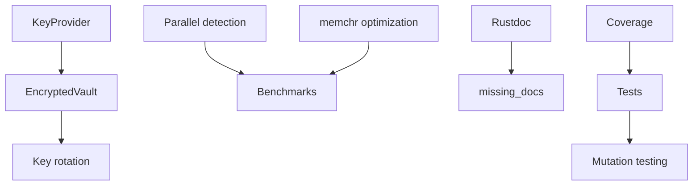

# Implementation Plan: Codebase Excellence Initiative

**Branch**: `022-codebase-improvements` | **Date**: 2025-12-18 | **Spec**: [spec.md](./spec.md)
**Input**: Feature specification from `/specs/022-codebase-improvements/spec.md`

## Summary

Focused codebase improvements across 7 categories: Security Hardening, Test Coverage, Documentation, API Extensions, Performance, Maintainability, and Code Quality. This initiative addresses 40 functional requirements with 17 measurable success criteria.

## Technical Context

**Language/Version**: Rust 1.75+ (stable, 2021 edition)
**Primary Dependencies**:
- Existing: serde, tokio, axum, clap, rayon, regex, aes-gcm, sha2
- New: cargo-fuzz, cargo-mutants, cargo-llvm-cov, criterion, memchr, utoipa (OpenAPI)
**Storage**: File-based (JSONL audit logs, encrypted vault files)
**Testing**: cargo test, wasm-pack test, cargo-mutants, proptest, criterion benchmarks
**Target Platform**: Linux/macOS/Windows (CLI, API), WASM (browser)
**Project Type**: Workspace with 15+ crates
**Performance Goals**:
- 100 pages PDF in <5s
- <500MB for 1000-page documents
- 50%+ throughput improvement with parallelization
**Constraints**:
- <200MB memory for 100MB file processing
- Zero cargo-audit warnings
- 90% test coverage, 80% mutation score
**Scale/Scope**: 15 existing crates, ~5k LOC additions

## Constitution Check

*GATE: Must pass before Phase 0 research. Re-check after Phase 1 design.*

| Principle | Status | Notes |
|-----------|--------|-------|
| I. Security First | PASS | FR-001 to FR-006 directly address security; encryption, fuzzing, auditing |
| II. Stability & Error Handling | PASS | Result<T,E> throughout; comprehensive error handling |
| III. Performance | PASS | FR-024 to FR-029 optimize performance; benchmarks required |
| IV. Simplicity & Minimalism | PASS | Feature flags (FR-038) reduce complexity; no unnecessary abstractions |
| V. Test-First Development | PASS | FR-007 to FR-014 mandate comprehensive testing; TDD required |
| VI. Dependency Discipline | PASS | FR-005 cargo-audit; FR-036 dependabot monitors deps |
| VII. Rust Standards | PASS | FR-035 enforces missing_docs; standard clippy warnings |

**Gate Result**: PASS - All constitution principles aligned with spec requirements.

## Project Structure

### Documentation (this feature)

```text
specs/022-codebase-improvements/
├── plan.md              # This file
├── spec.md              # Feature specification
├── research.md          # Phase 0 output
├── data-model.md        # Phase 1 output
├── quickstart.md        # Phase 1 output
├── contracts/           # Phase 1 output
│   └── openapi.yaml     # REST API specification
└── tasks.md             # Phase 2 output (via /speckit.tasks)
```

### Source Code (repository root)

```text
crates/
├── veil-core/           # Enhanced: SensitiveString tests (FR-008)
├── veil-crypto/         # Enhanced: EncryptedVault, KeyProvider (FR-001-003)
├── veil-parsers/        # Enhanced: Streaming JSON/HTML (FR-025-026)
├── veil-detect/         # Enhanced: Parallel detection, memchr (FR-024, FR-040)
├── veil-redact/         # Enhanced: Tests for all styles (FR-010)
├── veil-policy/         # Enhanced: Integration tests (FR-007)
├── veil-audit/          # Unchanged
├── veil-discovery/      # Enhanced: Symlink/archive tests (FR-011)
├── veil-batch/          # Unchanged
├── veil-stream/         # Unchanged
├── veil-api/            # Enhanced: Batch endpoint, ETag (FR-021, FR-023)
├── veil-cli/            # Unchanged
├── veil-wasm/           # Enhanced: PDF support, browser tests (FR-009, FR-022)
├── veil-email/          # Unchanged
└── veil-office/         # Unchanged

# Root-level additions
├── .github/
│   ├── workflows/
│   │   ├── ci.yml                # Enhanced: coverage, mutation, audit
│   │   └── release.yml           # Enhanced: SBOM, changelog
│   ├── ISSUE_TEMPLATE/           # NEW (FR-037)
│   ├── PULL_REQUEST_TEMPLATE.md  # NEW (FR-038)
│   └── dependabot.yml            # NEW (FR-043)
├── examples/                     # NEW (FR-017)
│   ├── basic_scan.rs
│   ├── batch_processing.rs
│   ├── policy_usage.rs
│   ├── streaming.rs
│   └── wasm_integration/
├── benches/                      # NEW (FR-030)
│   ├── detection.rs
│   ├── parsing.rs
│   └── encryption.rs
├── fuzz/                         # NEW (FR-004)
│   ├── fuzz_targets/
│   │   ├── pdf_parser.rs
│   │   ├── email_parser.rs
│   │   ├── office_parser.rs
│   │   └── policy_yaml.rs
├── docs/
│   ├── ARCHITECTURE.md           # NEW (FR-016)
│   └── api/
│       └── openapi.yaml          # NEW (FR-019)
├── CONTRIBUTING.md               # NEW (FR-036)
├── CHANGELOG.md                  # NEW (FR-018)
├── justfile                      # NEW (FR-044)
└── .pre-commit-config.yaml       # NEW (FR-040)
```

**Structure Decision**: Workspace structure maintained. No new crates needed - enhancements to existing crates only.

## Complexity Tracking

| Violation | Why Needed | Simpler Alternative Rejected Because |
|-----------|------------|-------------------------------------|
| Streaming parsers | Large file support without OOM | Smaller files only limits real-world use |
| Feature flags | Reduces binary size for minimal deployments | All-inclusive binaries are too large |

## Implementation Phases

### Phase 1: Foundation (P1 Requirements)

**Security Hardening (FR-001 to FR-006)**
1. Implement EncryptedVault in veil-crypto
2. Add KeyProvider trait with LocalKeyProvider, EnvKeyProvider
3. Add key rotation mechanism
4. Set up cargo-fuzz targets
5. Add cargo-audit to CI
6. Configure SBOM generation

**Test Coverage (FR-007 to FR-014)**
1. Add veil-policy integration tests
2. Add veil-core SensitiveString tests
3. Set up wasm-pack browser tests
4. Add veil-redact style tests
5. Add veil-discovery symlink/archive tests
6. Configure cargo-mutants in CI
7. Configure cargo-llvm-cov in CI
8. Add proptest for all validators

### Phase 2: Documentation & API (P2 Requirements)

**Documentation (FR-015 to FR-020)**
1. Add rustdoc comments to all public items
2. Create ARCHITECTURE.md with Mermaid diagrams
3. Create examples/ directory
4. Create CHANGELOG.md
5. Generate OpenAPI spec with utoipa
6. Generate TypeScript definitions for WASM

**API Extensions (FR-021 to FR-023)**
1. Implement POST /api/v1/batch endpoint
2. Add PDF support to veil-wasm
3. Add ETag header support

**Performance (FR-024 to FR-029)**
1. Parallelize detection with rayon
2. Implement streaming JSON parser
3. Implement streaming HTML parser
4. Add LRU regex cache
5. Create criterion benchmarks
6. Add memory bounds configuration

### Phase 3: Maintainability & Quality (P3 Requirements)

**Maintainability (FR-030 to FR-037)**
1. Create CONTRIBUTING.md
2. Create GitHub issue templates
3. Create PR template
4. Configure release automation
5. Set up pre-commit hooks
6. Enable #![deny(missing_docs)]
7. Configure dependabot.yml
8. Create justfile

**Architecture (FR-038)**
1. Configure feature flags for optional dependencies

**Code Quality (FR-039 to FR-040)**
1. Extract magic numbers to constants
2. Add memchr to detection hot paths

## Risk Assessment

| Risk | Likelihood | Impact | Mitigation |
|------|------------|--------|------------|
| WASM PDF library size | High | Medium | Lazy loading, tree shaking |
| Mutation testing performance | Medium | Low | Run only on CI, not local |
| Streaming parser complexity | Medium | Medium | Comprehensive tests, fallback to buffered |

## Dependencies Between Requirements



## Next Steps

1. Run `/speckit.tasks` to generate actionable task list
2. Begin Phase 1 with security hardening (highest priority)
3. Set up CI enhancements early to validate all changes
